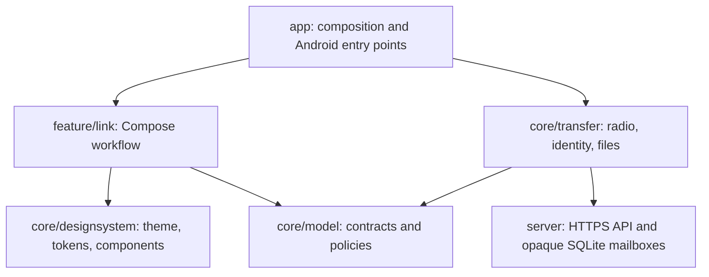
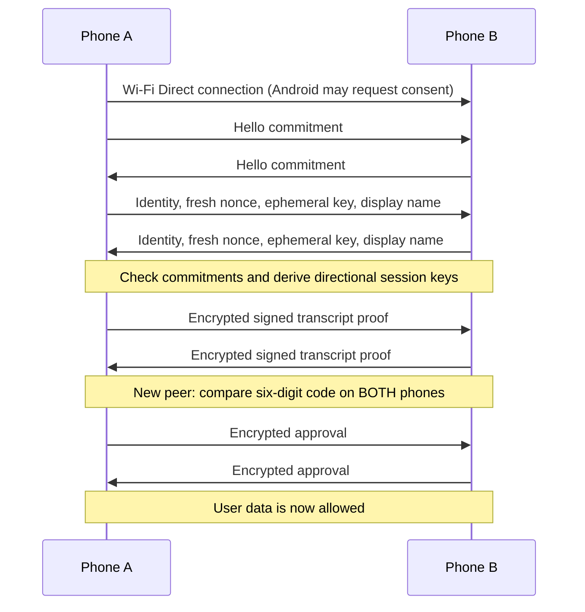
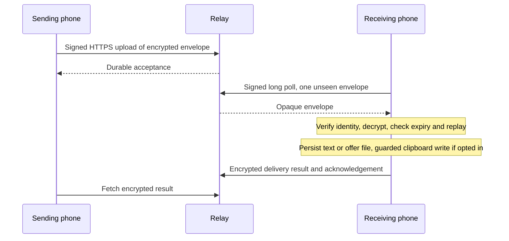

# Architecture

DeviceLink is a native Android application installed on both phones. Nearby
sharing uses Android Wi-Fi Direct and a framed authenticated encrypted TCP
channel. Optional Internet Link uses a self-hosted encrypted mailbox; neither
mode requires Fortress or Google Play services.

## Modules

`app` owns Activity result launchers, Sharesheet input, clipboard access, foreground
service, notification, Quick Settings tile and constructor wiring. The screen
layer consumes `LinkState` and issues `LinkController` commands; it cannot import
transport implementations. The model module has no Android dependency.

`NativeLinkController` serializes protocol state on Main and publishes immutable
StateFlow snapshots. File reads/writes and socket IO run on IO dispatchers.
`WifiDirectRadio` owns Android peer discovery, PBC connection negotiation, group
owner/server selection and framed sockets. DNS-SD filters the list to DeviceLink
advertisements and requests both service and name records. On Android 13+, bounded
scan/listen intervals make the receiving phone reachable. A selected peer is
refreshed against Android's peer list before connecting; transient discovery
`BUSY` during negotiation must not tear down the system consent prompt.
`IdentityStore` owns Android Keystore
identity and private metadata persistence.

`InternetLinkController` owns optional relay sessions, selected-peer routing,
encrypted payload processing, receipts and file offers. `RelayStore` persists
Keystore-wrapped Tink encryption keys, trusted bundles, settings and replay state;
`RelayHttpClient` signs exact request bytes and uses platform TLS validation.
The independent `server/` Python service authenticates requests and enforces
recipient consent, durable mailbox quotas, acknowledgement and expiry. It does
not decrypt payloads. See [[Internet-Link]] for its deployment/API boundaries.

## Connection and trust

Remembered trust is a public-key fingerprint, not a Wi-Fi MAC address or display
name. Every new connection proves key possession with fresh challenges. Wi-Fi
peer names are discovery hints; authenticated DeviceLink names replace them once
Hello is verified. QR carries identity fingerprint plus discovery address when
available; it does not grant file or clipboard access by itself.

## Nearby data path

Text is a bounded encrypted message. The receiver adds it to the tray and sends
a receipt; ordinary `Text` never writes the system clipboard automatically.

Explicit linked copy uses separate `Clip` and `ClipResult` messages. A one-shot
`IncomingClip` event carries its session token to the application's Main-thread
collector. The collector checks that the event and unexpired session are still
current, performs the OS clipboard write, then reports success/failure. Only that
callback updates clipboard outcome and sends the peer's result. Ordinary receipts
cannot complete a clipboard operation. Stop, cancellation and reconnect invalidate
pending events. See [[Clipboard]] for limits, timeouts and compatibility.

`ClipImageOffer` sends bounded image bytes through the nearby file framing path,
then emits a one-shot `IncomingImageClip` after validation and durable storage.
The app imports a stable private image URI and rechecks the current session and
clipboard-action order before the OS write. A newer accepted text/image copy
supersedes older pending images; a stale image can remain a received file without
replacing the clipboard. MIME/dimensions and a sampled decode validate image data.

The chat sample's Send action persists a local message through the application;
it does not invoke transport. Only message Copy actions use linked copy. Local
history is app-private, bounded to 50 messages and never synchronized.
Image history uses private files; image paste preview is a local action too.

Files begin as scoped Android content URIs from the Sharesheet or document picker.
DeviceLink reads metadata and opens a descriptor. The receiver sees an offer and
must accept before file bytes are sent. Chunks are authenticated records associated
with a particular accepted offer, with declared byte count enforced. Completion
requires final-size verification, flushing the received file, moving it from
private staging storage and durably recording its index before a receipt.
Per-item index mutations protect concurrent removal and completion. Cancellation
or failed persistence rolls back staging/index changes; startup removes abandoned
partial files.

Encrypted frame writes serialize counter allocation and socket output. Cancelling
one transfer cannot abandon a consumed cipher counter halfway through a write;
socket failures close the link, and a stalled write has a 30-second close watchdog.
Session expiry waits for pending acknowledgements as well as active transfers.
Partial files are removed on cancellation/failure. Completed files use a scoped
FileProvider URI for Open/Save/Share.

## Internet data path

After both phones save relay settings, the verified nearby connection exchanges
identity-signed HPKE public-key bundles. The client pins each bundle to the
connected, remembered signing identity. Async relay payloads are encrypted using
Tink HPKE and signed by that identity; the live nearby session cipher is not reused.

Envelope kind and file metadata are encrypted; routing/timing/sequence remain
public and are bound into encryption context and signature. The client stores
consumed IDs and a separate clipboard sequence per sender. This prevents stale
clipboard application without preventing later acceptance of an older file.
Ordinary relay text persists privately with expiry filtering on load/save;
clipboard text is ephemeral. Offered files persist locally as encrypted envelopes. Whole files
are capped at 8 MiB in relay mode; there is no resumable chunk protocol.

## Session lifecycle

Off has no active discovery, connection or timer. A user action starts the
foreground service and a bounded discovery period. Connecting stops discovery.
A session deadline blocks new work; an active transfer may finish before teardown.
Explicit Turn off cancels immediately. Process death does not restart a session.

Internet Link has an independent foreground service and 15-minute deadline. It
long-polls up to 25 seconds, requests one envelope per response and excludes local
file offers awaiting a decision. Its deadline prevents new work and gives active
operations and their callbacks up to 60 seconds to finish, then closes HTTP work.
Explicit Stop remains immediate. The server retains accepted unacknowledged envelopes
until expiry. Off does not poll and no push/boot restart is installed.

## Boundaries and limitations

Only one nearby peer is connected at a time; Internet Link sends to a selected
trusted peer. There is no remote wake-up, background clipboard monitor,
chunk-level resume or system privilege. Persisted relay offers and accepted server
envelopes can survive process death; live nearby transfers do not.
Wi-Fi Direct is hardware/OEM-dependent and may conflict with a mobile hotspot.
Nearby wire limits live in `core/model/WireProtocol.kt`; relay limits and encrypted
payload contracts live in `RelayCodec.kt` and `RelayContract.kt`.
