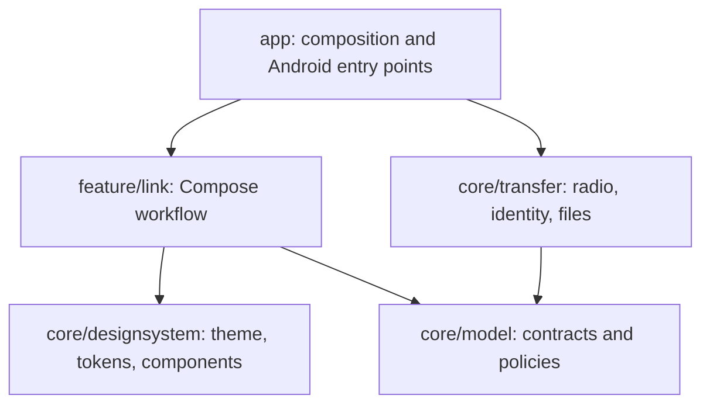
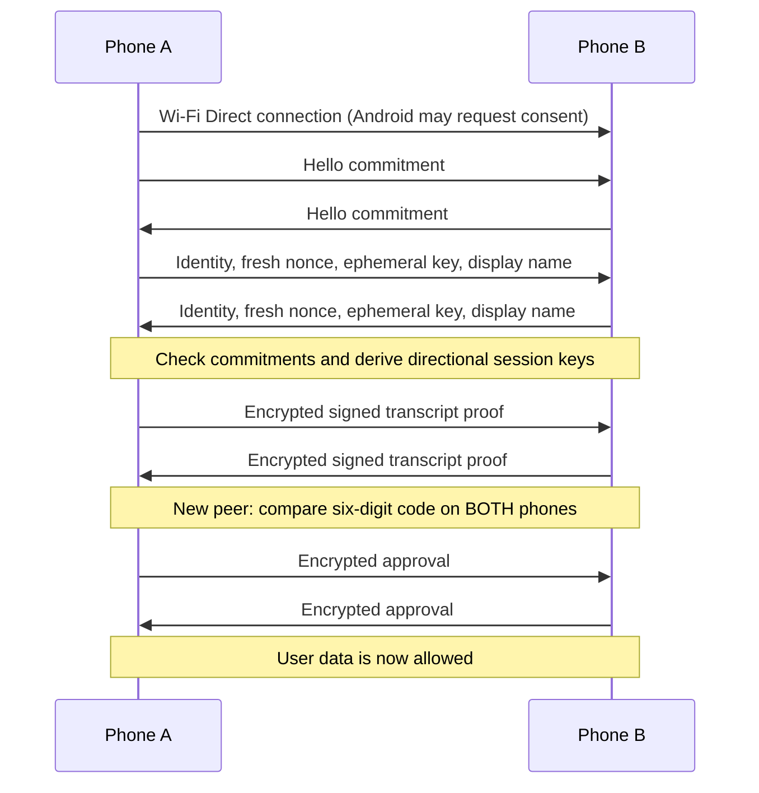

# Architecture

DeviceLink is a single native Android application installed on both phones.
There is no server. Android Wi-Fi Direct forms the local network; a framed TCP
channel carries authenticated encrypted control messages and file chunks.

## Modules

`app` owns Activity result launchers, Sharesheet input, clipboard access, foreground
service, notification, Quick Settings tile and constructor wiring. The screen
layer consumes `LinkState` and issues `LinkController` commands; it cannot import
transport implementations. The model module has no Android dependency.

`NativeLinkController` serializes protocol state on Main and publishes immutable
StateFlow snapshots. File reads/writes and socket IO run on IO dispatchers.
`WifiDirectRadio` owns Android peer discovery, PBC connection negotiation, group
owner/server selection and framed sockets. DNS-SD filters the list to DeviceLink
advertisements and requests both service and name records. On Android 13+, bounded
scan/listen intervals make the receiving phone reachable. A selected peer is
refreshed against Android's peer list before connecting; transient discovery
`BUSY` during negotiation must not tear down the system consent prompt.
`IdentityStore` owns Android Keystore
identity and private metadata persistence.

## Connection and trust

Remembered trust is a public-key fingerprint, not a Wi-Fi MAC address or display
name. Every new connection proves key possession with fresh challenges. Wi-Fi
peer names are discovery hints; authenticated DeviceLink names replace them once
Hello is verified. QR carries identity fingerprint plus discovery address when
available; it does not grant file or clipboard access by itself.

## Data path

Text is a bounded encrypted message. The receiver adds it to the tray and sends
a receipt; ordinary `Text` never writes the system clipboard automatically.

Explicit linked copy uses separate `Clip` and `ClipResult` messages. A one-shot
`IncomingClip` event carries its session token to the application's Main-thread
collector. The collector checks that the event and unexpired session are still
current, performs the OS clipboard write, then reports success/failure. Only that
callback updates clipboard outcome and sends the peer's result. Ordinary receipts
cannot complete a clipboard operation. Stop, cancellation and reconnect invalidate
pending events. See [[Clipboard]] for limits, timeouts and compatibility.

The chat sample's Send action persists a local message through the application;
it does not invoke transport. Only message Copy actions use linked copy. Local
history is app-private, bounded to 50 messages and never synchronized.

Files begin as scoped Android content URIs from the Sharesheet or document picker.
DeviceLink reads metadata and opens a descriptor. The receiver sees an offer and
must accept before file bytes are sent. Chunks are authenticated records associated
with a particular accepted offer, with declared byte count enforced. Completion
requires final-size verification, flushing the received file, moving it from
private staging storage and durably recording its index before a receipt.
Per-item index mutations protect concurrent removal and completion. Cancellation
or failed persistence rolls back staging/index changes; startup removes abandoned
partial files.

Encrypted frame writes serialize counter allocation and socket output. Cancelling
one transfer cannot abandon a consumed cipher counter halfway through a write;
socket failures close the link, and a stalled write has a 30-second close watchdog.
Session expiry waits for pending acknowledgements as well as active transfers.
Partial files are removed on cancellation/failure. Completed files use a scoped
FileProvider URI for Open/Save/Share.

## Session lifecycle

Off has no active discovery, connection or timer. A user action starts the
foreground service and a bounded discovery period. Connecting stops discovery.
A session deadline blocks new work; an active transfer may finish before teardown.
Explicit Turn off cancels immediately. Process death does not restart a session.

## Boundaries and limitations

Only one peer is connected at a time. The app has no cloud relay, remote wake-up,
background clipboard monitor, cross-process resume, or system privilege.
Wi-Fi Direct is hardware/OEM-dependent and may conflict with a mobile hotspot.
All exact wire limits live in `core/model/WireProtocol.kt`, and are tested there.
